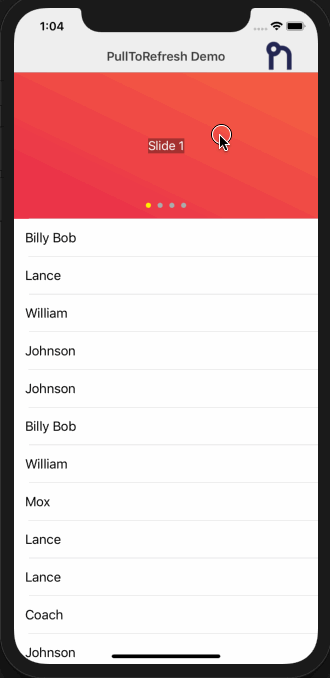

[](https://www.npmjs.com/package/nativescript-pulltorefresh)
[](https://www.npmjs.com/package/nativescript-pulltorefresh)

# NativeScript-PullToRefresh :recycle:
NativeScript plugin to use Pull to Refresh on any view. 

#### [Android - *SwipeRefreshLayout*](http://developer.android.com/reference/android/support/v4/widget/SwipeRefreshLayout.html)

#### [iOS - *UIRefreshControl*](https://developer.apple.com/library/ios/documentation/UIKit/Reference/UIRefreshControl_class/)

### Sample Screen

Android |  iOS
-------- | ---------
 | 


## Installation
`tns plugin add nativescript-pulltorefresh`

## Usage

### Vanilla NativeScript
#### XML
```XML
<page xmlns="http://schemas.nativescript.org/tns.xsd"
      xmlns:PullRefresh="nativescript-pulltorefresh"
      loaded="pageLoaded">
    <PullRefresh:PullToRefresh refresh="refreshList">
        <list-view items="{{ users }}">
            <list-view.itemTemplate>
                <label text="{{ name }}" row="0" col="1"textWrap="true" class="message" />             
            </list-view.itemTemplate>
        </list-view>
    </PullRefresh:PullToRefresh>        
</page>
```

#### JS
```JS
function refreshList(args) {

    // Get reference to the PullToRefresh component;
    var pullRefresh = args.object;

    // Do work here... and when done call set refreshing property to false to stop the refreshing
    loadItems().then((resp) => {
        // ONLY USING A TIMEOUT TO SIMULATE/SHOW OFF THE REFRESHING
        setTimeout(() => {
            pullRefresh.refreshing = false;
        }, 1000);
    }, (err) => {
        pullRefresh.refreshing = false;
    });
}
exports.refreshList = refreshList;
```
### Angular NativeScript

```TS
import { registerElement } from "nativescript-angular/element-registry";
registerElement("PullToRefresh", () => require("nativescript-pulltorefresh").PullToRefresh);

refreshList(args) {
         var pullRefresh = args.object;
         setTimeout(function () {
            pullRefresh.refreshing = false;
         }, 1000);
    }
```

#### HTML
```HTML
<PullToRefresh (refresh)="refreshList($event)">
    <ListView [items]="itemList" >
        <template let-item="item">
            <Label [text]="item.id"></Label>
        </template>
    </ListView>
</PullToRefresh>
```

### Webpack
If you are using webpack with **uglify** for Android, you must add [SwipeRefreshListener](pulltorefresh.android.ts#L70) to the mangle exception list.

#### webpack.config.js
```JS
    if (env.uglify) {
         plugins.push(new webpack.LoaderOptionsPlugin({ minimize: true }));
 
         const mangle =  {
            except: [
                ...nsWebpack.uglifyMangleExcludes,
                "SwipeRefreshListener" 
            ]
         };
        
         // Work around an Android issue by setting compress = false
         const compress = platform !== "android";
         
         plugins.push(new webpack.optimize.UglifyJsPlugin({
            mangle,
            compress,
         }));
     }
```

## Properties
- **refresh : function** *required*
- **refreshing: boolean** - Notifies the widget that the refresh state has changed.
