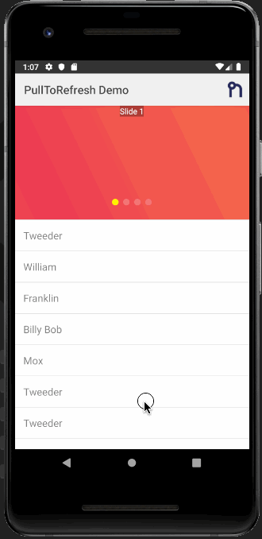

[](https://www.npmjs.com/package/nativescript-pulltorefresh)
[](https://www.npmjs.com/package/nativescript-pulltorefresh)
[](https://github.com/bradmartin/nativescript-pulltorefresh/stargazers)
[](https://github.com/bradmartin/nativescript-pulltorefresh/network)
[](https://www.paypal.me/bradwayne88)

# NativeScript-PullToRefresh :recycle:

NativeScript plugin to use Pull to Refresh on any view.

#### [Android - _SwipeRefreshLayout_](http://developer.android.com/reference/android/support/v4/widget/SwipeRefreshLayout.html)

#### [iOS - _UIRefreshControl_](https://developer.apple.com/library/ios/documentation/UIKit/Reference/UIRefreshControl_class/)

### Sample Screen

| Android                                        | iOS                                    |
| ---------------------------------------------- | -------------------------------------- |
|  |  |

## Installation

`tns plugin add nativescript-pulltorefresh`

## Usage

### Vanilla NativeScript

#### XML

```XML
<page xmlns="http://schemas.nativescript.org/tns.xsd"
      xmlns:PullRefresh="nativescript-pulltorefresh"
      loaded="pageLoaded">
    <PullRefresh:PullToRefresh refresh="refreshList">
        <list-view items="{{ users }}">
            <list-view.itemTemplate>
                <label text="{{ name }}" row="0" col="1"textWrap="true" class="message" />
            </list-view.itemTemplate>
        </list-view>
    </PullRefresh:PullToRefresh>
</page>
```

#### JS

```JS
function refreshList(args) {

    // Get reference to the PullToRefresh component;
    var pullRefresh = args.object;

    // Do work here... and when done call set refreshing property to false to stop the refreshing
    loadItems().then((resp) => {
        // ONLY USING A TIMEOUT TO SIMULATE/SHOW OFF THE REFRESHING
        setTimeout(() => {
            pullRefresh.refreshing = false;
        }, 1000);
    }, (err) => {
        pullRefresh.refreshing = false;
    });
}
exports.refreshList = refreshList;
```

### Angular NativeScript

```TS
import { registerElement } from "nativescript-angular/element-registry";
registerElement("PullToRefresh", () => require("nativescript-pulltorefresh").PullToRefresh);

refreshList(args) {
         var pullRefresh = args.object;
         setTimeout(function () {
            pullRefresh.refreshing = false;
         }, 1000);
    }
```

#### HTML

```HTML
<PullToRefresh (refresh)="refreshList($event)">
    <ListView [items]="itemList" >
        <template let-item="item">
            <Label [text]="item.id"></Label>
        </template>
    </ListView>
</PullToRefresh>
```

### NativeScript Vue

```javascript
import Vue from 'nativescript-vue';

Vue.registerElement(
  'PullToRefresh',
  () => require('nativescript-pulltorefresh').PullToRefresh
);
```

#### Component

```vue
<template>
  <Page>
    <PullToRefresh @refresh="refreshList">
      <ListView for="item in listOfItems" @itemTap="onItemTap">
        <v-template>
          <!-- Shows the list item label in the default color and style. -->
          <label :text="item.text" />
        </v-template>
      </ListView>
    </PullToRefresh>
  </Page>
</template>

<script>
export default {
  methods: {
    refreshList(args) {
      var pullRefresh = args.object;
      setTimeout(function() {
        pullRefresh.refreshing = false;
      }, 1000);
    }
  }
};
</script>
```

### Webpack

If you are using webpack with **uglify** for Android, you must add
[TNS_wipeRefreshListener](./pulltorefresh.android.ts#L72) to the mangle exception
list.

#### webpack.config.js

```JS
if (uglify) {
    config.plugins.push(new webpack.LoaderOptionsPlugin({ minimize: true }));

    // Work around an Android issue by setting compress = false
    const compress = platform !== "android";
    config.plugins.push(new UglifyJsPlugin({
        uglifyOptions: {
            mangle: { reserved: [ ...nsWebpack.uglifyMangleExcludes, "TNS_SwipeRefreshListener" ] },
            compress,
        }
    }));
}
```

## Properties

- **refresh : function** _required_
- **refreshing: boolean** - Notifies the widget that the refresh state has
  changed.

## [Changelog](./CHANGELOG.md)
